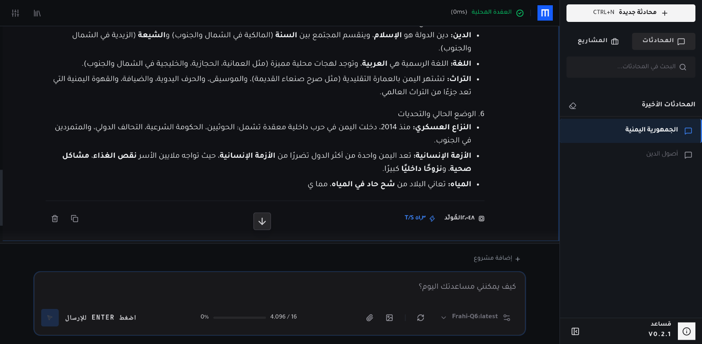
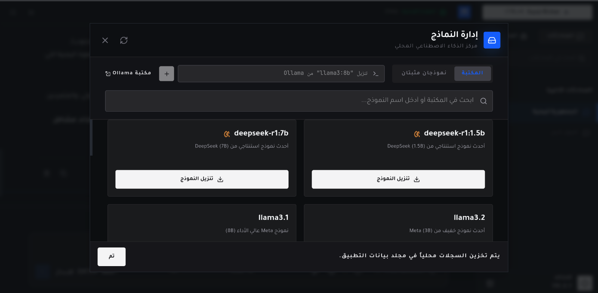
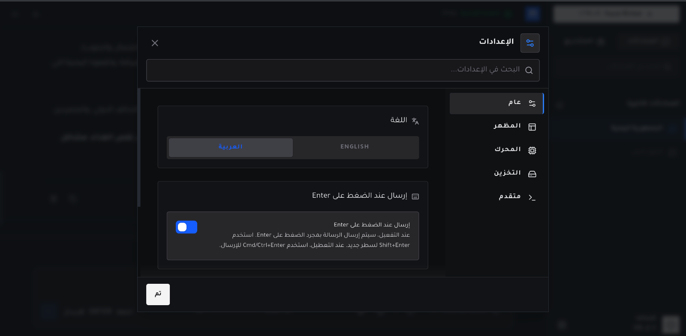
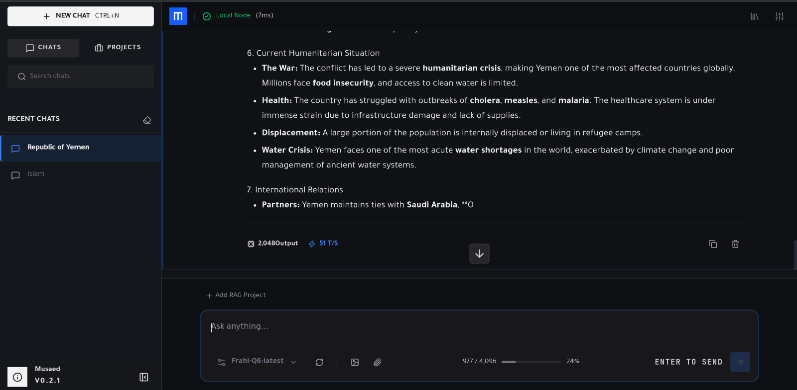
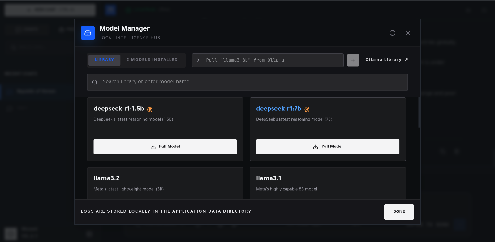
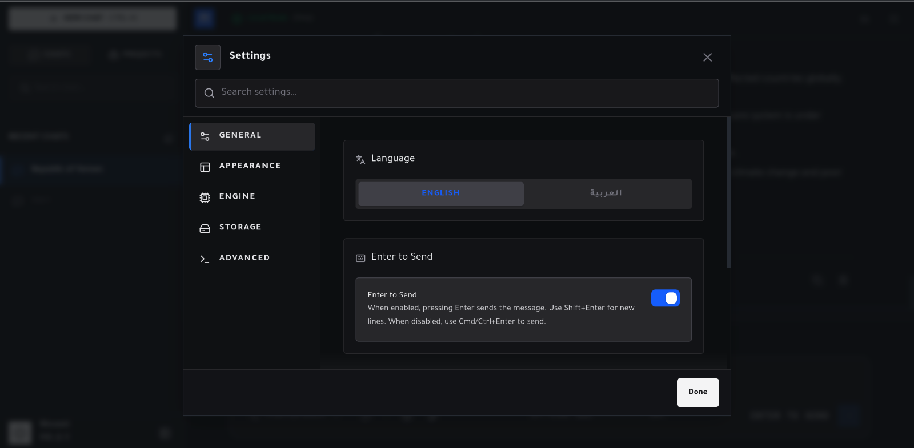

<div dir="rtl">

# مُساعد (Musaed) 🤖

[](LICENSE)
[](https://tauri.app/)
[](https://nextjs.org/)
[](https://reactjs.org/)
[](https://www.rust-lang.org/)
[](https://www.typescriptlang.org/)
[](https://ollama.com/)

> 🌐 **Available in English:** You can view this document in English [via this link](README.md).

مساعد ذكاء اصطناعي مكتبي محلي (Native Desktop AI Assistant) يعمل دون اتصال بالإنترنت وموجه لحماية الخصوصية، مبني باستخدام **Tauri 2** و **Next.js 16 (App Router)** و **React 19** مع نواة برمجية بلغة **Rust**. يعمل النظام بالاعتماد على خادم الذكاء الاصطناعي المحلي **Ollama**، ليقدم محادثات بتدفق البيانات الحي (Streaming)، ونظام استرجاع معلومات معزز بالتوليد (RAG) يعتمد تجزئة الكود البرمجي عبر شجرة البنية المجردة (AST-aware) والبحث الهجين (Hybrid BM25 & Vector Search)، مع دعم للغة العربية (RTL)، وقاعدة بيانات محلية SQLite تدعم الترحيل التلقائي للمعاملات—مع تشغيل محلي دون اتصالات شبكية خارجية أو تتبع للبيانات (Zero Telemetry).

---

## المميزات الرئيسية

- **محرك الذكاء الاصطناعي والمحادثة الفورية**:
  - تدفق حي للإجابات (Streaming) مباشرة من نماذج Ollama المحلية مع التحكم في الضغط العكسي (Backpressure) ودعم إلغاء الاستجابة.
  - إدارة الجلسات والمحادثات متعددة الجولات مع توليد آلي لعناوين المحادثات من سياق الرسائل.
  - دعم تنسيق Markdown والوسائط: معادلات رياضية عبر KaTeX، مخططات بيانية عبر Mermaid، تمييز لوني للشيفرات البرمجية مع نسخ بنقرة واحدة، ومربعات تفكير قابلة للطي لنماذج التفكير (Thinking Models).
  - تصيير افتراضي لقائمة الرسائل عبر `react-virtuoso` لأداء سلس أثناء التمرير في المحادثات الطويلة.
  - تحكم تفاعلي بالرسائل: تعديل وإعادة إرسال رسائل المستخدم (Edit-and-resend)، حذف رسائل مفردة، وإرفاق الملفات.
- **نظام استرجاع المعلومات المعزز بالتوليد المحلي (Local RAG)**:
  - **مساحات عمل متعددة المشاريع**: فهرسة المشاريع البرمجية والمستندات المحلية مع احترام ملفات `.gitignore` عبر حزمة `ignore` (محرك ripgrep).
  - **تجزئة دلالية للكود بالاعتماد على شجرة البنية (AST-Aware Chunking)**: تقسيم الكود البرمجي بمحلل `tree-sitter` لـ 9 لغات (Rust, TypeScript/JavaScript, Python, Java, Go, C, C++, JSON, YAML)، إلى جانب تجزئة Markdown حسب العناوين وتجزئة النصوص العادية بالنوافذ المنزلقة.
  - **مستودع متجهات مدمج (Embedded Vector Store)**: تخزين ومطابقة المتجهات محلياً في SQLite عبر ملحق `sqlite-vec` المدمج مع `rusqlite`.
  - **محرك بحث هجين (Hybrid Search)**: دمج نتائج البحث بالمتجهات (`sqlite-vec`) مع البحث اللفظي BM25 عبر وزن خطي محدد (0.6 للمتجهات و 0.4 لمعيار BM25 بعد معادلته).
  - **تجميع السياق وتتبع الاستشهادات**: تنسيق القطع المسترجعة داخل سياق موجه للنموذج ضمن حد محدد للأحرف (`MAX_RAG_CONTEXT_CHARS`) مع الحفاظ على مسارات الملفات ونطاقات الأسطر والاستشهادات.
  - **إلغاء التكرار والتحديث التراكمي**: فحص تجزئة الملفات والقطع عبر `xxhash-rust` (XXH3) لتخطي المحتوى غير المتغير أثناء إعادة الفهرسة.
  - **معالجة في الخلفية**: خط معالجة غير متزامن وقابل للإلغاء مع بث أحداث التقدم للواجهة لحظياً.
- **إدارة نماذج Ollama**:
  - متصفح لمكتبة النماذج لاستعراض النماذج المثبتة، تنزيل نماذج جديدة مع متابعة التقدم، وحذف النماذج.
  - متابعة حية لنسبة تنزيل النماذج بالبايت مع دعم الإلغاء.
  - تعديل معاملات التوليد لكل نموذج (درجة الحرارة، top-p، ونافذة السياق) عبر لوحة `ModelParamsPanel`.
  - تبديل النماذج مع إلغاء التدفق النشط فوراً عند التبديل أو مغادرة الصفحة لمنع تعليق المهام.
- **تنظيم المحادثات والبحث**:
  - شريط جانبي يجمع المحادثات زمنياً (اليوم، أمس، آخر 7 أيام، أقدم).
  - إدارة المحادثات: إنشاء محادثة جديدة، إعادة التسمية، الحذف، مسح كافة المحادثات، والتصدير.
  - تصدير المحادثات بصيغة Markdown منظمة تشمل العنوان، اسم النموذج، تاريخ الإنشاء، أدوار الرسائل، النصوص بعد تنظيفها، وإحصائيات سرعة توليد الرموز (Tokens/sec).
  - بحث نصي فوري على مستوى الرسائل عبر SQLite FTS5 (فهرس Trigram) مع نافذة بحث تدعم التنقل بلوحة المفاتيح.
- **غلاف مكتبي أصيل (Desktop Native)**:
  - إدارة نوافذ التطبيق المكتبي عبر منصات متعددة بواسطة Tauri 2.
  - تكامل مع صينية النظام (System Tray) مع حماية المهام (اعتراض إغلاق النافذة للتصغير إلى الصينية أثناء نشاط البث أو التنزيل أو الفهرسة).
  - شريط قوائم أصيل لنظام macOS مترجم ثنائياً عبر `cmd_menu_rebuild`.
  - منع تكرار تشغيل التطبيق عبر `tauri-plugin-single-instance`.
  - استخدام نوافذ اختيار الملفات والمجلدات الأصلية للنظام لاختيار المشاريع والمرفقات وتصدير الملفات.
  - ضوابط أمنية تشمل فحص مسارات الملفات (`path_guard.rs`)، والتحقق من المدخلات، وتحديد معدل استدعاءات IPC (`rate_limiter.rs`).
- **واجهة مستخدم ثنائية اللغة وتدعم العربية (RTL)**:
  - دعم كامل للغتين العربية (من اليمين لليسار) والإنجليزية (من اليسار لليمين).
  - خط عربي مخصص (`Tajawal`).
  - عكس اتجاه الأيقونات وعناصر التحكم تلقائياً حسب اتجاه الواجهة (`.mirror-rtl`).
  - فحص اكتمال مفاتيح الترجمة آلياً (`pnpm i18n:check`) واختبارات انحدار بصري بواسطة Playwright للواجهات العربية.
- **معمارية منضبطة وسلامة البيانات**:
  - تقسيم ميزات الواجهة وفق التصميم الموجه بالنطاق (DDD) مع ملفات بيان (`feature.manifest.ts`) تخضع للتحقق الآلي.
  - جسر اتصالات موحد (`apps/web/src/lib/ipc.ts`) يمنع استدعاءات Tauri المباشرة من داخل الميزات.
  - فحص تطابق عقود أوامر Rust وواجهات TypeScript الصارم (`validate:contracts --strict`).
  - نظام ترحيل قواعد بيانات SQLite تعاملي برمجياً مع تتبع الإصدارات (قاعدة المحادثات v7، وقاعدة RAG v5) ودعم التراجع للمحادثات.
  - سجلات تتبع هيكلية بمعرفات تتبع، ومراقبة أوقات استجابة IPC، وتطهير السجلات وإخفاء المسارات من الأخطاء.

---

## واجهات المستخدم ولقطات الشاشة

### الواجهة العربية (RTL)

|          الشاشة الرئيسية والمحادثة          |           مكتبة النماذج المحلية           |            الإعدادات والتفضيلات             |
| :-----------------------------------------: | :---------------------------------------: | :-----------------------------------------: |
|  |  |  |

### الواجهة الإنجليزية (LTR)

|               Homepage & Chat               |               Model Library               |           Settings & Preferences            |
| :-----------------------------------------: | :---------------------------------------: | :-----------------------------------------: |
|  |  |  |

---

## حزمة التقنيات المستخدمة

| الطبقة البرمجية                          | التقنية المستخدمة                                                                        |
| :--------------------------------------- | :--------------------------------------------------------------------------------------- |
| **غلاف التطبيق المكتبي (Desktop Shell)** | Tauri 2.0.0-rc.0 (بيئة تشغيل Rust 2021 Edition)                                          |
| **إطار الواجهة الأمامية (Frontend)**     | Next.js 16.3.5 (App Router وتصدير ثابت Static Export), React 19.3.0, TypeScript 5.9.3    |
| **التنسيق والرسوم المتحركة**             | Tailwind CSS 4.3.3, Lucide React 1.46.0, Framer Motion 12.38.0                           |
| **إدارة الحالة (State Management)**      | Zustand 5.0.15 (8 مخازن حالة معزولة حسب النطاق في `apps/web/src/store/`)                 |
| **استدلال الذكاء الاصطناعي المحلي**      | Ollama HTTP API (تدفق حي للبيانات محلياً، تنزيل النماذج، وفحص الاتصال)                   |
| **تصيير Markdown والرياضيات**            | React Markdown 9.0.3, KaTeX 0.18.7, Mermaid 11.16.1, highlight.js 11.12.0                |
| **العرض الافتراضي للقوائم**              | React Virtuoso 4.18.13                                                                   |
| **قواعد البيانات والمتجهات**             | SQLite (مدمجة عبر `rusqlite` 0.40), `sqlite-vec` 0.1 للبحث المتجهي                       |
| **تجزئة الكود وتصفح الملفات**            | Tree-sitter 0.26 (محللات لـ 9 لغات), حزمة `ignore` 0.4 (محرك Ripgrep)                    |
| **محرك البحث وإلغاء التكرار**            | محرك تصنيف مخصص BM25 و SQLite FTS5 (Trigram), وحزمة `xxhash-rust` 0.8 (تجزئة سريعة XXH3) |
| **عقود الربط والتحقق**                   | حزمة العقود المشتركة `@musaed/contracts`, Zod 4.6.5, Specta 2.0                          |
| **منظومة الاختبارات والجودة**            | Vitest 5.0.0, Playwright 1.63.0, Cargo Test, Clippy, dependency-cruiser 18.3.0           |

---

</div>

## التشغيل والتثبيت (Getting Started)

<div dir="rtl">

### المتطلبات الأساسية

- **Node.js**: إصدار `v22.x` أو أحدث.
- **pnpm**: إصدار `v11.x` أو أحدث (`pnpm` مطلوب إلزاميًا).
- **Rust**: حزمة أدوات مستقرة تشمل (`rustc`, `cargo`, `rustfmt`, `clippy`).
- **Ollama**: مثبت ويعمل محلياً على جهازك ([ollama.com](https://ollama.com)).
- **مكتبات النظام المطلوبة (في توزيعات Linux مثل Ubuntu/Debian)**:

</div>

```bash
sudo apt-get update && sudo apt-get install -y \
  libwebkit2gtk-4.1-dev libappindicator3-dev librsvg2-dev patchelf libssl-dev
```

<div dir="rtl">

### 1. تثبيت الاعتماديات والحزم

</div>

```bash
pnpm install
```

<div dir="rtl">

### 2. تجهيز وتشغيل نماذج Ollama

تأكد من تشغيل خادم Ollama وتحميل النموذج المفضل لديك للمحادثة أو البرمجة:
</div>

```bash
# تشغيل خدمة Ollama (إذا لم تكن تعمل بالفعل في الخلفية)
ollama serve

# تنزيل نموذج مناسب للمحادثة أو البرمجة
ollama pull llama3.2
# أو
ollama pull qwen2.5-coder
```

<div dir="rtl">

### 3. تشغيل التطبيق في بيئة التطوير

لتشغيل التطبيق المكتبي بالكامل (واجهة Next.js وخلفية Tauri Rust):
</div>

```bash
pnpm dev
```

<div dir="rtl">
إذا كنت ترغب في تشغيل واجهة الويب فقط في المتصفح دون تشغيل نافذة Tauri:
</div>

```bash
pnpm dev:web
```

<div dir="rtl">

### 4. البناء للإنتاج (Production Build)

للتحقق من كافة القواعد المعمارية، وفحص ملفات الترجمة، وتوليد التصدير الثابت، وتجميع الملف التنفيذي المكتبي:
</div>

```bash
pnpm prod:build
```

<div dir="rtl">
ستجد الملفات التنفيذية وحزم التثبيت الناتجة في المجلد: `src-tauri/target/release/bundle/`.

---

## الأوامر المتاحة

تُدار وتُنفذ كافة الأوامر والمهام عبر `pnpm` و `cargo`:

| الأمر                                                                                           | الوصف                                                                            |
| :---------------------------------------------------------------------------------------------- | :------------------------------------------------------------------------------- |
| `pnpm dev`                                                                                      | تشغيل التطبيق في وضع التطوير (واجهة Next.js وخلفية Rust معاً)                    |
| `pnpm dev:web`                                                                                  | تشغيل خادم تطوير Next.js فقط في المتصفح دون خلفية Tauri                          |
| `pnpm build`                                                                                    | بناء الحزمة التنفيذية لتطبيق Tauri في بيئة الإنتاج                               |
| `pnpm prod:build`                                                                               | بناء إنتاجي كامل يشمل التحقق المعماري، فحص الترجمة، التصدير الثابت، وبناء Tauri  |
| `pnpm test`                                                                                     | تشغيل اختبارات الوحدة للواجهة الأمامية عبر Vitest                                |
| `pnpm --filter web test:integration`                                                            | تشغيل اختبارات التكامل للواجهة الأمامية عبر Vitest                               |
| `pnpm lint`                                                                                     | فحص الشيفرة المصدرية في `apps/web/src` بواسطة ESLint                             |
| `pnpm type-check`                                                                               | التحقق من صحة أنواع TypeScript عبر جميع حزم ومشاريع المستودع                     |
| `pnpm arch-check`                                                                               | فحص القيود والحدود المعمارية واستيراد الميزات عبر dependency-cruiser             |
| `pnpm validate`                                                                                 | تشغيل الفحص الشامل: التنسيق، فحص الأنواع، فحص الترجمة، وبيانات الميزات           |
| `pnpm validate:contracts --strict`                                                              | التحقق الصارم من تطابق عقود أوامر Rust مع واجهات TypeScript                      |
| `pnpm validate:acl`                                                                             | التأكد من تغطية صلاحيات أوامر IPC بنسبة 100%                                     |
| `pnpm validate:manifests`                                                                       | التحقق من صحة ملفات بيان الميزات (Manifests) وواجهاتها العامة                    |
| `pnpm codegen:feature-deps`                                                                     | توليد مخطط ارتباطات واعتماديات الميزات برمجياً من ملفات البيان                   |
| `pnpm codegen:validation`                                                                       | توليد ثوابت وحدود التحقق المشتركة مع Rust                                        |
| `pnpm i18n:sync`                                                                                | مزامنة مفاتيح الترجمة بين الملفين `en.json` و `ar.json`                          |
| `pnpm i18n:check`                                                                               | التحقق الصارم من اكتمال الترجمة وعدم وجود أي مفاتيح مفقودة                       |
| `pnpm gate`                                                                                     | بوابة التحقق الكاملة قبل الاعتماد: تشمل الفحص، العقود، الصلاحيات، واختبارات Rust |
| `cargo fmt --all --manifest-path src-tauri/Cargo.toml -- --check`                               | التحقق من تنسيق كود Rust                                                         |
| `cargo clippy --all-targets --all-features --manifest-path src-tauri/Cargo.toml -- -D warnings` | فحص جودة كود Rust بدون السماح بأي تحذيرات                                        |
| `cargo test --manifest-path src-tauri/Cargo.toml`                                               | تشغيل كافة اختبارات الوحدة والتكامل لنواة Rust                                   |

---

## هيكلية المشروع وهندسة النظام

يعتمد مشروع مُساعد بنية مستودع أحادي (Monorepo) منظم ومحكم العزل:

</div>

```text
musaed/
├── apps/
│   └── web/                   # تطبيق واجهة المستخدم (Next.js 16 App Router وتصدير ثابت)
│       ├── locales/           # قواميس الترجمة ثنائية اللغة (en.json, ar.json)
│       ├── src/
│       │   ├── app/           # صفحات وتخطيطات Next.js ومزودات السياق العامة
│       │   ├── features/      # وحدات الميزات المبنية وفق أسلوب (DDD)
│       │   ├── lib/           # جسر الاتصال المركزي (ipc.ts)، محرك الترجمة، والأدوات المشتركة
│       │   ├── store/         # 8 مخازن حالة معزولة مبنية عبر Zustand
│       │   └── styles/        # تنسيقات Tailwind v4، والخطوط، والرسوم المتحركة
│       └── e2e/               # اختبارات الانحدار البصري عبر Playwright (RTL و LTR)
├── packages/
│   └── contracts/             # حزمة العقود المشتركة، مخططات Zod، وسجل أوامر IPC
├── src-tauri/                 # خلفية النظام المكتبي المكتوبة بلغة Rust (Tauri 2)
│   ├── Cargo.toml             # حزم واعتماديات Rust (rusqlite, tree-sitter, reqwest, tokio)
│   └── src/
│       ├── conversation/      # خدمة المحادثات، مستودع تخزين SQLite، وأوامر المحادثة
│       ├── rag/               # نطاق RAG (محلل Tree-sitter، محرك BM25، المتجهات sqlite-vec)
│       ├── ollama/            # عميل Ollama للتدفق الحي، إدارة الإلغاء، وإدارة النماذج
│       ├── migrations/        # إطار ترحيل قواعد بيانات SQLite البرمجي (للمحادثات و RAG)
│       ├── logging/           # نظام التتبع الهيكلي، مسجل الملفات، وتطهير السجلات
│       ├── fs/                # أوامر التعامل الآمن مع نظام الملفات
│       └── lib.rs             # نقطة تسجيل أوامر Tauri وإدارة دورة حياة التطبيق
├── docs/                      # الأدلة المعمارية والتشغيلية المعتمدة
├── scripts/                   # سكربتات التحقق الآلي في CI ومطابقة العقود وتوليد الكود
└── STANDARDS.md               # المعايير الهندسية الصارمة للنظام (المرجع الأساسي للتطوير)
```

<div dir="rtl">

### طبقات النظام الأساسية

1. **طبقة الواجهة الأمامية (`apps/web`)**: غلاف واجهة المستخدم المبني بـ React 19 وتنسيقات Tailwind v4 ومخازن حالة Zustand.
2. **جسر الاتصال IPC (`apps/web/src/lib/ipc.ts`)**: الممر المعتمد والوحيد للتواصل بين الواجهة والعمليات الأصلية للنظام. يُمنع استدعاء `window.__TAURI__` مباشرة منعاً باتاً.
3. **طبقة العقود (`packages/contracts`)**: المصدر الموثوق لكافة أنواع TypeScript، مخططات التحقق Zod، وسجل أوامر IPC، وميزانيات أوقات الاستجابة.
4. **طبقة الحقيقة والتشغيل بلغة Rust (`src-tauri`)**: المحرك لإدارة تدفق Ollama، حفظ واسترجاع SQLite، خطوط معالجة RAG، والتفاعل مع نظام التشغيل.
5. **طبقة مخازن الحالة في الذاكرة**: 8 مخازن Zustand متخصصة ومحددة النطاق (`conversation`, `library`, `rag`, `settings`، إلخ) تتبع سياسة تعديل واضحة ومنضبطة.

### وحدات الميزات الوظيفية (DDD)

تم تقسيم الواجهة إلى 8 وحدات ميزات معزولة ومستقلة داخل مجلد `apps/web/src/features/`. تصدر كل ميزة واجهة برمجية عامة محددة (`index.ts`) ويتم التحقق من حدودها عبر ملف بيان (`feature.manifest.ts`):

| الميزة         | المسؤولية الوظيفية                                                                   |
| :------------- | :----------------------------------------------------------------------------------- |
| `conversation` | إدارة المحادثات مع Ollama — التدفق الحي، حفظ الرسائل، المرفقات، ومربعات التفكير      |
| `sidebar`      | الشريط الجانبي للمحادثات — الترتيب الزمني، المجموعات، والتصدير إلى Markdown          |
| `library`      | إدارة نماذج Ollama — استعراض النماذج، التنزيل مع مؤشر التقدم، فحص المعلمات، والحذف   |
| `rag`          | الذكاء المعزز بالاسترجاع — مشاريع العمل، فهرسة الملفات، تجزئة الكود، والبحث الهجين   |
| `settings`     | إعدادات وتفضيلات التطبيق — رابط خادم Ollama، المظهر، اللغة، التخزين، وحالة الترحيلات |
| `search`       | البحث النصي الفوري والشامل عبر كافة الرسائل والمحادثات المخزنة                       |
| `info`         | نافذة حول التطبيق — رقم الإصدار، التراخيص، والملاحظات التقنية                        |
| `layout`       | جذر التكوين والربط — يقوم بتركيب كافة الميزات وبناء الغلاف الرئيسي للتطبيق           |

تخضع استيرادات الميزات لفحص آلي بواسطة `dependency-cruiser` في بيئة CI، ويتم رفض أي استيراد مخالف فوراً.

---

## الاختبارات وضمان الجودة (Quality Assurance)

يطبق مشروع مُساعد معايير فحص آلية على كافة المستويات:

</div>

```bash
# تشغيل بوابة التحقق الكاملة محلياً قبل إرسال التعديلات
pnpm gate
```

<div dir="rtl">

### 1. اختبارات الوحدة والتكامل للواجهة الأمامية

تعتمد على **Vitest** و **React Testing Library**:

- اختبارات وحدة مدمجة بجانب مكونات وخطافات كل ميزة.
- اختبارات تكامل تحاكي استجابات جسر IPC، وتحديثات مخازن Zustand، ودورة حياة التدفق الحي.

### 2. اختبارات الانحدار البصري (RTL / LTR)

تعتمد على **Playwright**:

- لقطات شاشة آلية تتحقق من دقة الواجهة العربية (RTL)، وجودة تصيير الخط العربي (`Tajawal`)، وانعكاس اتجاه الأيقونات.
- وظيفة فحص إلزامية في CI توقف البناء فوراً عند حدوث أي خلل في اتجاه الواجهة أو تخطيطها.

### 3. اختبارات نواة Rust الخلفية

تعتمد على **Cargo Test**:

- اختبارات وحدة لخوارزميات RAG، ونقاط BM25، وتجزئة AST، وتطهير مسارات الملفات.
- اختبارات تكامل لترحيل جداول SQLite، وإجراءات التراجع، والتحكم في ضغط تدفق Ollama.

### 4. سير عمل التكامل المستمر (GitHub Actions CI)

يتم فحص كل التزام (Commit) وطلب سحب (Pull Request) عبر 5 مسارات فحص مؤتمتة (`.github/workflows/ci.yml`):

1. **التحقق الشامل (Validate)**: فحص ESLint، وتدقيق أنواع TypeScript، وتحليل الحدود المعمارية، وتطابق الترجمة، ومطابقة عقود IPC الصارمة، وصلاحيات الأوامر، والتأكد من خلو الشيفرة من وسوم TODO/FIXME.
2. **الاختبارات (Test)**: تشغيل اختبارات وحدة وتكامل الواجهة، وفحص أمان الحزم عبر `pnpm audit`.
3. **فحوصات Rust**: فحص التنسيق (`cargo fmt`)، ومحلل الجودة (`cargo clippy` بدون تحذيرات)، واختبارات `cargo test`، وفحص الثغرات عبر `cargo audit`.
4. **الاختبارات البصرية (Visual Tests)**: اختبارات Playwright للمظهر والاتجاه من اليمين لليسار (RTL).
5. **بناء التطبيق (Build)**: التحقق من نجاح التصدير الثابت لواجهة Next.js، وبناء الحزمة التنفيذية لـ Tauri.

---

## المراجع والتوثيق المعماري

للاطلاع على التوثيق المفصل لمعمارية النظام وإجراءات العمل:

- [المعايير الهندسية الصارمة (STANDARDS.md)](./STANDARDS.md) — المرجع الأساسي لهندسة النظام (قراءة إلزامية للمساهمين)
- [إطار ترحيل قواعد بيانات SQLite](docs/migration-framework.md) — تفاصيل نظام ترحيل وإصدارات قواعد البيانات برمجياً
- [تطبيق وفرض عقود Tauri IPC](docs/tauri-ipc-enforcement.md) — قواعد أمان الاتصال ومطابقة العقود البرمجية
- [التتبع الهيكلي وسجلات النظام](docs/structured-logging.md) — هندسة سجلات المراقبة وتطهير السجلات
- [التشغيل على أنظمة الملفات الشبكية](docs/deployment-network-fs.md) — بروتوكولات قفل SQLite وسلامة البيانات
- [حزمة العقود المشتركة](packages/contracts/README.md) — توثيق العقود وسجل أوامر IPC
- [توثيق خلفية Rust](src-tauri/README.md) — بنية خدمات ونطاقات وأوامر `src-tauri`
- **توثيق الميزات**: ملفات README مخصصة لكل ميزة داخل مجلد `apps/web/src/features/*/README.md`

---

## الأمان وحماية الخصوصية

- **انعدام الاتصالات الخارجية (Zero Telemetry)**: لا يُجري مُساعد أي اتصال خارجي بالإنترنت إطلاقاً. تقتصر الاتصالات على المنفذ المحلي الداخلي لجهازك (Local Loopback مثل `http://127.0.0.1:11434`).
- **تخزين محلي بحت**: تُحفظ كافة المحادثات، والمتجهات، والإعدادات داخل ملفات SQLite محلية في مجلد بيانات التطبيق.
- **حماية مسارات الملفات**: تخضع كافة عمليات قراءة الملفات لتدقيق وفحص أمني عبر `path_guard.rs` لمنع ثغرات التراجع في المسارات (Path Traversal).
- **تطهير السجلات وإخفاء المسارات**: تخضع سجلات التتبع وأخطاء النظام الخلفية لتطهير آلي لإزالة مسارات الملفات الحساسة وشيفرات ANSI والرموز الخاصة قبل إخراجها.

---

## المساهمة والتطوير

نرحب بكافة المساهمات في تطوير مشروع **مُساعد (Musaed)**! يُرجى مراجعة [دليل المساهمة (CONTRIBUTING.md)](CONTRIBUTING.md) و [المعايير الهندسية (STANDARDS.md)](STANDARDS.md) قبل البدء في كتابة التعديلات.

### التحقق قبل إرسال طلب السحب (PR)

قبل إنشاء طلب سحب، تأكد من اجتياز بوابة الفحص والتحقق المحلية بنجاح:

```bash
pnpm gate
```

سيتكفل الفحص باكتشاف أي تجاوزات للحدود المعمارية، أو نقص في مفاتيح الترجمة، أو عدم تطابق في عقود البرمجة.

---

## الترخيص

هذا المشروع منشور ومرخص بموجب شروط رخصة [Apache License 2.0](LICENSE).

</div>
